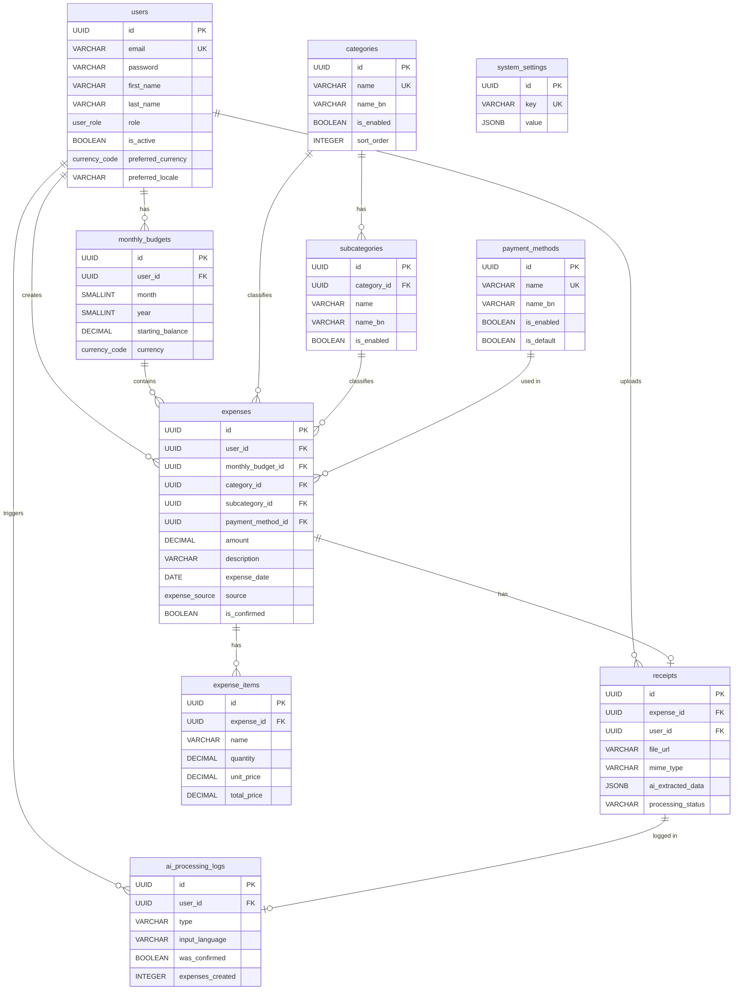

# Expense Tracker — Database Schema

## Overview

This document defines the complete PostgreSQL database schema for the Expense Tracker application. All tables, columns, data types, constraints, relationships, indexes, and enums are documented below.

> **Encoding**: The database uses `UTF-8` encoding to support both English and Bangla (বাংলা) text in all string fields.

---

## Enum Types

```sql
-- User roles for RBAC
CREATE TYPE user_role AS ENUM ('user', 'admin');

-- Source of expense creation
CREATE TYPE expense_source AS ENUM ('manual', 'voice', 'receipt');

-- Currency codes (extensible via admin settings)
CREATE TYPE currency_code AS ENUM ('BDT', 'USD');
```

---

## Tables

### 1. `users`

Stores registered user accounts, credentials, and profile information.

| Column          | Type                    | Constraints                          | Description                              |
| --------------- | ----------------------- | ------------------------------------ | ---------------------------------------- |
| `id`            | `UUID`                  | `PK`, `DEFAULT gen_random_uuid()`    | Unique user identifier                   |
| `email`         | `VARCHAR(255)`          | `NOT NULL`, `UNIQUE`                 | User email address (login credential)    |
| `password`      | `VARCHAR(255)`          | `NOT NULL`                           | bcrypt-hashed password                   |
| `first_name`    | `VARCHAR(100)`          | `NOT NULL`                           | User's first name                        |
| `last_name`     | `VARCHAR(100)`          | `NOT NULL`                           | User's last name                         |
| `avatar_url`    | `VARCHAR(500)`          | `NULLABLE`                           | Profile picture URL (Cloudinary)         |
| `role`          | `user_role`             | `NOT NULL`, `DEFAULT 'user'`         | Role-based access: `user` or `admin`     |
| `is_active`     | `BOOLEAN`               | `NOT NULL`, `DEFAULT true`           | Account active status (admin can toggle) |
| `preferred_currency` | `currency_code`    | `NOT NULL`, `DEFAULT 'BDT'`          | User's preferred currency                |
| `preferred_locale`   | `VARCHAR(5)`        | `NOT NULL`, `DEFAULT 'en'`           | UI locale preference (`en` or `bn`)      |
| `last_login_at` | `TIMESTAMP WITH TIME ZONE` | `NULLABLE`                        | Last login timestamp                     |
| `created_at`    | `TIMESTAMP WITH TIME ZONE` | `NOT NULL`, `DEFAULT NOW()`       | Account creation timestamp               |
| `updated_at`    | `TIMESTAMP WITH TIME ZONE` | `NOT NULL`, `DEFAULT NOW()`       | Last profile update timestamp            |

```sql
CREATE TABLE users (
    id              UUID PRIMARY KEY DEFAULT gen_random_uuid(),
    email           VARCHAR(255) NOT NULL UNIQUE,
    password        VARCHAR(255) NOT NULL,
    first_name      VARCHAR(100) NOT NULL,
    last_name       VARCHAR(100) NOT NULL,
    avatar_url      VARCHAR(500),
    role            user_role NOT NULL DEFAULT 'user',
    is_active       BOOLEAN NOT NULL DEFAULT true,
    preferred_currency currency_code NOT NULL DEFAULT 'BDT',
    preferred_locale   VARCHAR(5) NOT NULL DEFAULT 'en',
    last_login_at   TIMESTAMP WITH TIME ZONE,
    created_at      TIMESTAMP WITH TIME ZONE NOT NULL DEFAULT NOW(),
    updated_at      TIMESTAMP WITH TIME ZONE NOT NULL DEFAULT NOW()
);
```

**Indexes:**
```sql
CREATE UNIQUE INDEX idx_users_email ON users (email);
CREATE INDEX idx_users_role ON users (role);
CREATE INDEX idx_users_is_active ON users (is_active);
CREATE INDEX idx_users_created_at ON users (created_at);
```

---

### 2. `categories`

System-wide expense categories managed by admins. Users select from enabled categories when creating expenses.

| Column          | Type                    | Constraints                          | Description                              |
| --------------- | ----------------------- | ------------------------------------ | ---------------------------------------- |
| `id`            | `UUID`                  | `PK`, `DEFAULT gen_random_uuid()`    | Unique category identifier               |
| `name`          | `VARCHAR(100)`          | `NOT NULL`, `UNIQUE`                 | Category name in English                 |
| `name_bn`       | `VARCHAR(100)`          | `NULLABLE`                           | Category name in Bangla (বাংলা)          |
| `icon`          | `VARCHAR(50)`           | `NULLABLE`                           | Icon identifier (e.g., Lucide icon name) |
| `color`         | `VARCHAR(7)`            | `NULLABLE`                           | Hex color code (e.g., `#FF5733`)         |
| `is_enabled`    | `BOOLEAN`               | `NOT NULL`, `DEFAULT true`           | Whether category is available for use    |
| `is_default`    | `BOOLEAN`               | `NOT NULL`, `DEFAULT false`          | Whether this is a system default         |
| `sort_order`    | `INTEGER`               | `NOT NULL`, `DEFAULT 0`              | Display ordering position                |
| `created_at`    | `TIMESTAMP WITH TIME ZONE` | `NOT NULL`, `DEFAULT NOW()`       | Creation timestamp                       |
| `updated_at`    | `TIMESTAMP WITH TIME ZONE` | `NOT NULL`, `DEFAULT NOW()`       | Last update timestamp                    |

```sql
CREATE TABLE categories (
    id              UUID PRIMARY KEY DEFAULT gen_random_uuid(),
    name            VARCHAR(100) NOT NULL UNIQUE,
    name_bn         VARCHAR(100),
    icon            VARCHAR(50),
    color           VARCHAR(7),
    is_enabled      BOOLEAN NOT NULL DEFAULT true,
    is_default      BOOLEAN NOT NULL DEFAULT false,
    sort_order      INTEGER NOT NULL DEFAULT 0,
    created_at      TIMESTAMP WITH TIME ZONE NOT NULL DEFAULT NOW(),
    updated_at      TIMESTAMP WITH TIME ZONE NOT NULL DEFAULT NOW()
);
```

**Indexes:**
```sql
CREATE INDEX idx_categories_is_enabled ON categories (is_enabled);
CREATE INDEX idx_categories_sort_order ON categories (sort_order);
```

**Default Seed Data:**

| Name                | Bangla Name           | Icon              | Color     |
| ------------------- | --------------------- | ----------------- | --------- |
| Food & Dining       | খাবার ও রেস্তোরাঁ       | `utensils`        | `#FF6B6B` |
| Transportation      | যাতায়াত               | `car`             | `#4ECDC4` |
| Housing             | বাসস্থান               | `home`            | `#45B7D1` |
| Shopping            | কেনাকাটা               | `shopping-bag`    | `#96CEB4` |
| Health & Medical    | স্বাস্থ্য ও চিকিৎসা      | `heart-pulse`     | `#FF8A80` |
| Education           | শিক্ষা                 | `graduation-cap`  | `#7C4DFF` |
| Entertainment       | বিনোদন                | `gamepad-2`       | `#FF6E40` |
| Travel              | ভ্রমণ                  | `plane`           | `#00BCD4` |
| Bills & Subscriptions | বিল ও সাবস্ক্রিপশন   | `receipt`         | `#FFD54F` |
| Financial           | আর্থিক                | `landmark`        | `#4DB6AC` |
| Family & Personal   | পরিবার ও ব্যক্তিগত     | `users`           | `#F48FB1` |
| Pets                | পোষা প্রাণী             | `paw-print`       | `#A1887F` |
| Work & Business     | কাজ ও ব্যবসা           | `briefcase`       | `#90A4AE` |
| Gifts & Donations   | উপহার ও দান            | `gift`            | `#CE93D8` |
| Other               | অন্যান্য               | `ellipsis`        | `#B0BEC5` |

---

### 3. `subcategories`

Configurable subcategories nested under parent categories.

| Column          | Type                    | Constraints                          | Description                              |
| --------------- | ----------------------- | ------------------------------------ | ---------------------------------------- |
| `id`            | `UUID`                  | `PK`, `DEFAULT gen_random_uuid()`    | Unique subcategory identifier            |
| `category_id`   | `UUID`                 | `FK → categories.id`, `NOT NULL`     | Parent category reference                |
| `name`          | `VARCHAR(100)`          | `NOT NULL`                           | Subcategory name in English              |
| `name_bn`       | `VARCHAR(100)`          | `NULLABLE`                           | Subcategory name in Bangla (বাংলা)       |
| `is_enabled`    | `BOOLEAN`               | `NOT NULL`, `DEFAULT true`           | Whether subcategory is available for use |
| `sort_order`    | `INTEGER`               | `NOT NULL`, `DEFAULT 0`              | Display ordering position                |
| `created_at`    | `TIMESTAMP WITH TIME ZONE` | `NOT NULL`, `DEFAULT NOW()`       | Creation timestamp                       |
| `updated_at`    | `TIMESTAMP WITH TIME ZONE` | `NOT NULL`, `DEFAULT NOW()`       | Last update timestamp                    |

```sql
CREATE TABLE subcategories (
    id              UUID PRIMARY KEY DEFAULT gen_random_uuid(),
    category_id     UUID NOT NULL REFERENCES categories(id) ON DELETE RESTRICT,
    name            VARCHAR(100) NOT NULL,
    name_bn         VARCHAR(100),
    is_enabled      BOOLEAN NOT NULL DEFAULT true,
    sort_order      INTEGER NOT NULL DEFAULT 0,
    created_at      TIMESTAMP WITH TIME ZONE NOT NULL DEFAULT NOW(),
    updated_at      TIMESTAMP WITH TIME ZONE NOT NULL DEFAULT NOW(),
    UNIQUE (category_id, name)
);
```

**Indexes:**
```sql
CREATE INDEX idx_subcategories_category_id ON subcategories (category_id);
CREATE INDEX idx_subcategories_is_enabled ON subcategories (is_enabled);
```

> [!NOTE]
> `ON DELETE RESTRICT` prevents deleting a category that still has subcategories. Admins must reassign or remove subcategories first.

---

### 4. `payment_methods`

System-wide payment methods managed by admins.

| Column          | Type                    | Constraints                          | Description                              |
| --------------- | ----------------------- | ------------------------------------ | ---------------------------------------- |
| `id`            | `UUID`                  | `PK`, `DEFAULT gen_random_uuid()`    | Unique payment method identifier         |
| `name`          | `VARCHAR(100)`          | `NOT NULL`, `UNIQUE`                 | Payment method name in English           |
| `name_bn`       | `VARCHAR(100)`          | `NULLABLE`                           | Payment method name in Bangla (বাংলা)    |
| `icon`          | `VARCHAR(50)`           | `NULLABLE`                           | Icon identifier                          |
| `is_enabled`    | `BOOLEAN`               | `NOT NULL`, `DEFAULT true`           | Whether method is available for use      |
| `is_default`    | `BOOLEAN`               | `NOT NULL`, `DEFAULT false`          | Whether this is a system default method  |
| `sort_order`    | `INTEGER`               | `NOT NULL`, `DEFAULT 0`              | Display ordering position                |
| `created_at`    | `TIMESTAMP WITH TIME ZONE` | `NOT NULL`, `DEFAULT NOW()`       | Creation timestamp                       |
| `updated_at`    | `TIMESTAMP WITH TIME ZONE` | `NOT NULL`, `DEFAULT NOW()`       | Last update timestamp                    |

```sql
CREATE TABLE payment_methods (
    id              UUID PRIMARY KEY DEFAULT gen_random_uuid(),
    name            VARCHAR(100) NOT NULL UNIQUE,
    name_bn         VARCHAR(100),
    icon            VARCHAR(50),
    is_enabled      BOOLEAN NOT NULL DEFAULT true,
    is_default      BOOLEAN NOT NULL DEFAULT false,
    sort_order      INTEGER NOT NULL DEFAULT 0,
    created_at      TIMESTAMP WITH TIME ZONE NOT NULL DEFAULT NOW(),
    updated_at      TIMESTAMP WITH TIME ZONE NOT NULL DEFAULT NOW()
);
```

**Indexes:**
```sql
CREATE INDEX idx_payment_methods_is_enabled ON payment_methods (is_enabled);
CREATE INDEX idx_payment_methods_sort_order ON payment_methods (sort_order);
```

**Default Seed Data:**

| Name           | Bangla Name     |
| -------------- | --------------- |
| Cash           | নগদ অর্থ         |
| Credit Card    | ক্রেডিট কার্ড     |
| Debit Card     | ডেবিট কার্ড      |
| Bank Transfer  | ব্যাংক ট্রান্সফার  |
| bKash          | বিকাশ           |
| Nagad          | নগদ             |
| Rocket         | রকেট            |
| Other          | অন্যান্য         |

---

### 5. `monthly_budgets`

Tracks per-user, per-month starting balance and calculated spending totals.

| Column             | Type                    | Constraints                          | Description                              |
| ------------------ | ----------------------- | ------------------------------------ | ---------------------------------------- |
| `id`               | `UUID`                  | `PK`, `DEFAULT gen_random_uuid()`    | Unique budget record identifier          |
| `user_id`          | `UUID`                  | `FK → users.id`, `NOT NULL`          | Owning user reference                    |
| `month`            | `SMALLINT`              | `NOT NULL`, `CHECK (1-12)`           | Calendar month (1 = January)             |
| `year`             | `SMALLINT`              | `NOT NULL`, `CHECK (2000-2100)`      | Calendar year                            |
| `starting_balance` | `DECIMAL(12,2)`         | `NOT NULL`, `DEFAULT 0.00`           | Fixed monthly starting budget            |
| `currency`         | `currency_code`         | `NOT NULL`, `DEFAULT 'BDT'`          | Currency for this budget period          |
| `created_at`       | `TIMESTAMP WITH TIME ZONE` | `NOT NULL`, `DEFAULT NOW()`       | Record creation timestamp                |
| `updated_at`       | `TIMESTAMP WITH TIME ZONE` | `NOT NULL`, `DEFAULT NOW()`       | Last update timestamp                    |

```sql
CREATE TABLE monthly_budgets (
    id                  UUID PRIMARY KEY DEFAULT gen_random_uuid(),
    user_id             UUID NOT NULL REFERENCES users(id) ON DELETE CASCADE,
    month               SMALLINT NOT NULL CHECK (month BETWEEN 1 AND 12),
    year                SMALLINT NOT NULL CHECK (year BETWEEN 2000 AND 2100),
    starting_balance    DECIMAL(12,2) NOT NULL DEFAULT 0.00,
    currency            currency_code NOT NULL DEFAULT 'BDT',
    created_at          TIMESTAMP WITH TIME ZONE NOT NULL DEFAULT NOW(),
    updated_at          TIMESTAMP WITH TIME ZONE NOT NULL DEFAULT NOW(),
    UNIQUE (user_id, month, year)
);
```

**Indexes:**
```sql
CREATE UNIQUE INDEX idx_monthly_budgets_user_period ON monthly_budgets (user_id, year, month);
```

**Computed Values (Application Layer):**

The following values are **not stored** but calculated at query time or in the application layer:

```text
total_spent       = SUM(amount) FROM expenses WHERE user_id = ? AND month = ? AND year = ? AND is_confirmed = true
remaining_balance = starting_balance - total_spent
spending_pct      = (total_spent / starting_balance) * 100
```

> [!IMPORTANT]
> `total_spent` and `remaining_balance` are derived from confirmed expenses, not stored columns. This prevents stale data and ensures consistency with the primary business rule.

---

### 6. `expenses`

Core table storing all expense records — manual, voice-generated, and receipt-generated.

| Column              | Type                    | Constraints                          | Description                                    |
| ------------------- | ----------------------- | ------------------------------------ | ---------------------------------------------- |
| `id`                | `UUID`                  | `PK`, `DEFAULT gen_random_uuid()`    | Unique expense identifier                      |
| `user_id`           | `UUID`                  | `FK → users.id`, `NOT NULL`          | Owning user reference                          |
| `monthly_budget_id` | `UUID`                  | `FK → monthly_budgets.id`, `NOT NULL`| Associated budget period                       |
| `category_id`       | `UUID`                  | `FK → categories.id`, `NOT NULL`     | Expense category reference                     |
| `subcategory_id`    | `UUID`                  | `FK → subcategories.id`, `NULLABLE`  | Expense subcategory reference (optional)       |
| `payment_method_id` | `UUID`                  | `FK → payment_methods.id`, `NULLABLE`| Payment method used (optional)                 |
| `amount`            | `DECIMAL(12,2)`         | `NOT NULL`, `CHECK (> 0)`            | Expense amount (positive value)                |
| `currency`          | `currency_code`         | `NOT NULL`, `DEFAULT 'BDT'`          | Currency of the expense                        |
| `description`       | `VARCHAR(500)`          | `NULLABLE`                           | Items or description (English or Bangla)       |
| `merchant`          | `VARCHAR(255)`          | `NULLABLE`                           | Merchant/vendor name                           |
| `notes`             | `TEXT`                  | `NULLABLE`                           | Additional user notes                          |
| `expense_date`      | `DATE`                  | `NOT NULL`                           | Date the expense occurred                      |
| `expense_time`      | `TIME`                  | `NULLABLE`                           | Time the expense occurred                      |
| `source`            | `expense_source`        | `NOT NULL`, `DEFAULT 'manual'`       | How the expense was created                    |
| `is_confirmed`      | `BOOLEAN`               | `NOT NULL`, `DEFAULT false`          | Only confirmed expenses affect balance         |
| `receipt_url`       | `VARCHAR(500)`          | `NULLABLE`                           | Cloudinary URL of associated receipt image     |
| `ai_raw_text`       | `TEXT`                  | `NULLABLE`                           | Original AI transcription or OCR text          |
| `ai_confidence`     | `DECIMAL(3,2)`          | `NULLABLE`, `CHECK (0.00-1.00)`      | AI extraction confidence score                 |
| `created_at`        | `TIMESTAMP WITH TIME ZONE` | `NOT NULL`, `DEFAULT NOW()`       | Record creation timestamp                      |
| `updated_at`        | `TIMESTAMP WITH TIME ZONE` | `NOT NULL`, `DEFAULT NOW()`       | Last update timestamp                          |

```sql
CREATE TABLE expenses (
    id                  UUID PRIMARY KEY DEFAULT gen_random_uuid(),
    user_id             UUID NOT NULL REFERENCES users(id) ON DELETE CASCADE,
    monthly_budget_id   UUID NOT NULL REFERENCES monthly_budgets(id) ON DELETE RESTRICT,
    category_id         UUID NOT NULL REFERENCES categories(id) ON DELETE RESTRICT,
    subcategory_id      UUID REFERENCES subcategories(id) ON DELETE SET NULL,
    payment_method_id   UUID REFERENCES payment_methods(id) ON DELETE SET NULL,
    amount              DECIMAL(12,2) NOT NULL CHECK (amount > 0),
    currency            currency_code NOT NULL DEFAULT 'BDT',
    description         VARCHAR(500),
    merchant            VARCHAR(255),
    notes               TEXT,
    expense_date        DATE NOT NULL,
    expense_time        TIME,
    source              expense_source NOT NULL DEFAULT 'manual',
    is_confirmed        BOOLEAN NOT NULL DEFAULT false,
    receipt_url         VARCHAR(500),
    ai_raw_text         TEXT,
    ai_confidence       DECIMAL(3,2) CHECK (ai_confidence BETWEEN 0.00 AND 1.00),
    created_at          TIMESTAMP WITH TIME ZONE NOT NULL DEFAULT NOW(),
    updated_at          TIMESTAMP WITH TIME ZONE NOT NULL DEFAULT NOW()
);
```

**Indexes:**
```sql
-- Primary query patterns
CREATE INDEX idx_expenses_user_id ON expenses (user_id);
CREATE INDEX idx_expenses_monthly_budget_id ON expenses (monthly_budget_id);
CREATE INDEX idx_expenses_category_id ON expenses (category_id);
CREATE INDEX idx_expenses_expense_date ON expenses (expense_date);
CREATE INDEX idx_expenses_source ON expenses (source);
CREATE INDEX idx_expenses_is_confirmed ON expenses (is_confirmed);

-- Composite indexes for common queries
CREATE INDEX idx_expenses_user_date ON expenses (user_id, expense_date DESC);
CREATE INDEX idx_expenses_user_confirmed ON expenses (user_id, is_confirmed) WHERE is_confirmed = true;
CREATE INDEX idx_expenses_user_category ON expenses (user_id, category_id);
CREATE INDEX idx_expenses_user_budget ON expenses (user_id, monthly_budget_id, is_confirmed);
```

> [!IMPORTANT]
> - `ON DELETE RESTRICT` on `category_id` and `monthly_budget_id` prevents accidental data loss — admins must reassign expenses before deleting a category or budget.
> - `ON DELETE SET NULL` on `subcategory_id` and `payment_method_id` allows soft removal while preserving the expense record.
> - `ON DELETE CASCADE` on `user_id` removes all expenses when a user account is deleted.

---

### 7. `expense_items`

Line items from receipt scanning — individual products/items within a single expense.

| Column          | Type                    | Constraints                          | Description                              |
| --------------- | ----------------------- | ------------------------------------ | ---------------------------------------- |
| `id`            | `UUID`                  | `PK`, `DEFAULT gen_random_uuid()`    | Unique item identifier                   |
| `expense_id`    | `UUID`                  | `FK → expenses.id`, `NOT NULL`       | Parent expense reference                 |
| `name`          | `VARCHAR(255)`          | `NOT NULL`                           | Item name (English or Bangla)            |
| `quantity`      | `DECIMAL(8,2)`          | `NOT NULL`, `DEFAULT 1.00`           | Quantity purchased                       |
| `unit_price`    | `DECIMAL(12,2)`         | `NOT NULL`                           | Price per unit                           |
| `total_price`   | `DECIMAL(12,2)`         | `NOT NULL`                           | `quantity × unit_price`                  |
| `sort_order`    | `INTEGER`               | `NOT NULL`, `DEFAULT 0`              | Display order on receipt                 |
| `created_at`    | `TIMESTAMP WITH TIME ZONE` | `NOT NULL`, `DEFAULT NOW()`       | Creation timestamp                       |

```sql
CREATE TABLE expense_items (
    id              UUID PRIMARY KEY DEFAULT gen_random_uuid(),
    expense_id      UUID NOT NULL REFERENCES expenses(id) ON DELETE CASCADE,
    name            VARCHAR(255) NOT NULL,
    quantity        DECIMAL(8,2) NOT NULL DEFAULT 1.00,
    unit_price      DECIMAL(12,2) NOT NULL,
    total_price     DECIMAL(12,2) NOT NULL,
    sort_order      INTEGER NOT NULL DEFAULT 0,
    created_at      TIMESTAMP WITH TIME ZONE NOT NULL DEFAULT NOW()
);
```

**Indexes:**
```sql
CREATE INDEX idx_expense_items_expense_id ON expense_items (expense_id);
```

---

### 8. `receipts`

Metadata for uploaded receipt images, linked to expenses.

| Column              | Type                    | Constraints                          | Description                              |
| ------------------- | ----------------------- | ------------------------------------ | ---------------------------------------- |
| `id`                | `UUID`                  | `PK`, `DEFAULT gen_random_uuid()`    | Unique receipt identifier                |
| `expense_id`        | `UUID`                  | `FK → expenses.id`, `NULLABLE`       | Associated expense (null before confirmation) |
| `user_id`           | `UUID`                  | `FK → users.id`, `NOT NULL`          | Uploading user reference                 |
| `original_filename` | `VARCHAR(255)`          | `NOT NULL`                           | Original uploaded filename               |
| `file_url`          | `VARCHAR(500)`          | `NOT NULL`                           | Cloudinary storage URL                   |
| `file_size`         | `INTEGER`               | `NOT NULL`                           | File size in bytes                       |
| `mime_type`         | `VARCHAR(20)`           | `NOT NULL`                           | `image/jpeg`, `image/png`, `image/webp`  |
| `ai_extracted_data` | `JSONB`                 | `NULLABLE`                           | Raw AI/OCR extraction result as JSON     |
| `processing_status` | `VARCHAR(20)`           | `NOT NULL`, `DEFAULT 'pending'`      | `pending`, `processing`, `completed`, `failed` |
| `created_at`        | `TIMESTAMP WITH TIME ZONE` | `NOT NULL`, `DEFAULT NOW()`       | Upload timestamp                         |

```sql
CREATE TABLE receipts (
    id                  UUID PRIMARY KEY DEFAULT gen_random_uuid(),
    expense_id          UUID REFERENCES expenses(id) ON DELETE SET NULL,
    user_id             UUID NOT NULL REFERENCES users(id) ON DELETE CASCADE,
    original_filename   VARCHAR(255) NOT NULL,
    file_url            VARCHAR(500) NOT NULL,
    file_size           INTEGER NOT NULL,
    mime_type           VARCHAR(20) NOT NULL CHECK (mime_type IN ('image/jpeg', 'image/png', 'image/webp')),
    ai_extracted_data   JSONB,
    processing_status   VARCHAR(20) NOT NULL DEFAULT 'pending'
                        CHECK (processing_status IN ('pending', 'processing', 'completed', 'failed')),
    created_at          TIMESTAMP WITH TIME ZONE NOT NULL DEFAULT NOW()
);
```

**Indexes:**
```sql
CREATE INDEX idx_receipts_expense_id ON receipts (expense_id);
CREATE INDEX idx_receipts_user_id ON receipts (user_id);
CREATE INDEX idx_receipts_processing_status ON receipts (processing_status);
```

**`ai_extracted_data` JSONB Structure:**
```json
{
  "merchant": "স্বপ্ন সুপারশপ",
  "date": "2026-08-15",
  "subtotal": 850.00,
  "tax": 42.50,
  "discount": 0.00,
  "total": 892.50,
  "payment_method": "bKash",
  "items": [
    { "name": "চাল (5kg)", "quantity": 1, "unit_price": 450.00, "total": 450.00 },
    { "name": "ডিম (12 পিস)", "quantity": 1, "unit_price": 180.00, "total": 180.00 },
    { "name": "তেল (1L)", "quantity": 1, "unit_price": 220.00, "total": 220.00 }
  ],
  "language_detected": "bn",
  "confidence": 0.92
}
```

---

### 9. `ai_processing_logs`

Audit trail for all AI voice and receipt processing events — used for admin analytics.

| Column          | Type                    | Constraints                          | Description                              |
| --------------- | ----------------------- | ------------------------------------ | ---------------------------------------- |
| `id`            | `UUID`                  | `PK`, `DEFAULT gen_random_uuid()`    | Unique log entry identifier              |
| `user_id`       | `UUID`                  | `FK → users.id`, `NOT NULL`          | User who triggered the AI processing     |
| `type`          | `VARCHAR(20)`           | `NOT NULL`                           | `voice` or `receipt`                     |
| `input_language`| `VARCHAR(5)`            | `NULLABLE`                           | Detected language (`en` or `bn`)         |
| `input_text`    | `TEXT`                  | `NULLABLE`                           | Raw voice transcription text             |
| `receipt_id`    | `UUID`                  | `FK → receipts.id`, `NULLABLE`       | Associated receipt (for receipt type)     |
| `output_data`   | `JSONB`                 | `NULLABLE`                           | Structured extraction result             |
| `expenses_created` | `INTEGER`            | `NOT NULL`, `DEFAULT 0`              | Number of expenses confirmed from this   |
| `was_confirmed` | `BOOLEAN`               | `NOT NULL`, `DEFAULT false`          | Whether user confirmed the result        |
| `error_message` | `TEXT`                  | `NULLABLE`                           | Error details if processing failed       |
| `processing_time_ms` | `INTEGER`          | `NULLABLE`                           | AI processing duration in milliseconds   |
| `created_at`    | `TIMESTAMP WITH TIME ZONE` | `NOT NULL`, `DEFAULT NOW()`       | Log creation timestamp                   |

```sql
CREATE TABLE ai_processing_logs (
    id                  UUID PRIMARY KEY DEFAULT gen_random_uuid(),
    user_id             UUID NOT NULL REFERENCES users(id) ON DELETE CASCADE,
    type                VARCHAR(20) NOT NULL CHECK (type IN ('voice', 'receipt')),
    input_language      VARCHAR(5),
    input_text          TEXT,
    receipt_id          UUID REFERENCES receipts(id) ON DELETE SET NULL,
    output_data         JSONB,
    expenses_created    INTEGER NOT NULL DEFAULT 0,
    was_confirmed       BOOLEAN NOT NULL DEFAULT false,
    error_message       TEXT,
    processing_time_ms  INTEGER,
    created_at          TIMESTAMP WITH TIME ZONE NOT NULL DEFAULT NOW()
);
```

**Indexes:**
```sql
CREATE INDEX idx_ai_logs_user_id ON ai_processing_logs (user_id);
CREATE INDEX idx_ai_logs_type ON ai_processing_logs (type);
CREATE INDEX idx_ai_logs_created_at ON ai_processing_logs (created_at);
```

---

### 10. `system_settings`

Key-value store for application-wide configuration managed by admins.

| Column          | Type                    | Constraints                          | Description                              |
| --------------- | ----------------------- | ------------------------------------ | ---------------------------------------- |
| `id`            | `UUID`                  | `PK`, `DEFAULT gen_random_uuid()`    | Unique setting identifier                |
| `key`           | `VARCHAR(100)`          | `NOT NULL`, `UNIQUE`                 | Setting key name                         |
| `value`         | `JSONB`                 | `NOT NULL`                           | Setting value (flexible JSON)            |
| `description`   | `VARCHAR(500)`          | `NULLABLE`                           | Human-readable description               |
| `updated_by`    | `UUID`                  | `FK → users.id`, `NULLABLE`          | Last admin who modified this setting     |
| `updated_at`    | `TIMESTAMP WITH TIME ZONE` | `NOT NULL`, `DEFAULT NOW()`       | Last update timestamp                    |

```sql
CREATE TABLE system_settings (
    id              UUID PRIMARY KEY DEFAULT gen_random_uuid(),
    key             VARCHAR(100) NOT NULL UNIQUE,
    value           JSONB NOT NULL,
    description     VARCHAR(500),
    updated_by      UUID REFERENCES users(id) ON DELETE SET NULL,
    updated_at      TIMESTAMP WITH TIME ZONE NOT NULL DEFAULT NOW()
);
```

**Default Settings:**

| Key                         | Default Value                  | Description                            |
| --------------------------- | ------------------------------ | -------------------------------------- |
| `default_currency`          | `"BDT"`                       | System default currency                |
| `supported_currencies`      | `["BDT", "USD"]`              | Available currency options             |
| `supported_locales`         | `["en", "bn"]`                | Available UI languages                 |
| `max_receipt_size_bytes`    | `10485760`                    | Max receipt upload size (10 MB)        |
| `low_balance_threshold_pct` | `10`                          | Low balance alert threshold (%)        |

---

## Entity Relationship Diagram



---

## Deletion & Cascade Rules Summary

| Parent Table       | Child Table          | On Delete Rule  | Rationale                                                      |
| ------------------ | -------------------- | --------------- | -------------------------------------------------------------- |
| `users`            | `monthly_budgets`    | `CASCADE`       | Deleting a user removes all their budget data                  |
| `users`            | `expenses`           | `CASCADE`       | Deleting a user removes all their expenses                     |
| `users`            | `receipts`           | `CASCADE`       | Deleting a user removes all their uploaded receipts            |
| `users`            | `ai_processing_logs` | `CASCADE`       | Deleting a user removes all their AI logs                      |
| `monthly_budgets`  | `expenses`           | `RESTRICT`      | Cannot delete a budget period that has expenses                |
| `categories`       | `subcategories`      | `RESTRICT`      | Must remove/reassign subcategories before deleting a category  |
| `categories`       | `expenses`           | `RESTRICT`      | Must reassign expenses before deleting a category              |
| `subcategories`    | `expenses`           | `SET NULL`       | Expense keeps its record, subcategory field becomes null       |
| `payment_methods`  | `expenses`           | `SET NULL`       | Expense keeps its record, payment method field becomes null    |
| `expenses`         | `expense_items`      | `CASCADE`       | Deleting an expense removes all its line items                 |
| `expenses`         | `receipts`           | `SET NULL`       | Receipt is preserved even if expense is deleted                |

---

## Key Constraints & Business Rules

1. **Unique expense IDs**: Every expense has a globally unique UUID (`gen_random_uuid()`).
2. **User data isolation**: All queries are scoped by `user_id` — enforced at the application layer via JWT guards.
3. **Balance consistency**: `remaining_balance` is always computed, never stored, from confirmed expenses.
4. **Confirmed-only impact**: Only rows with `is_confirmed = true` are included in balance and analytics calculations.
5. **Category protection**: Categories with associated expenses cannot be deleted (`ON DELETE RESTRICT`).
6. **One budget per month**: The `UNIQUE (user_id, month, year)` constraint ensures a single budget record per user per month.
7. **Positive amounts**: The `CHECK (amount > 0)` constraint prevents zero or negative expenses.
8. **Bilingual fields**: `name_bn` columns on `categories`, `subcategories`, and `payment_methods` store Bangla translations alongside the English `name`.
